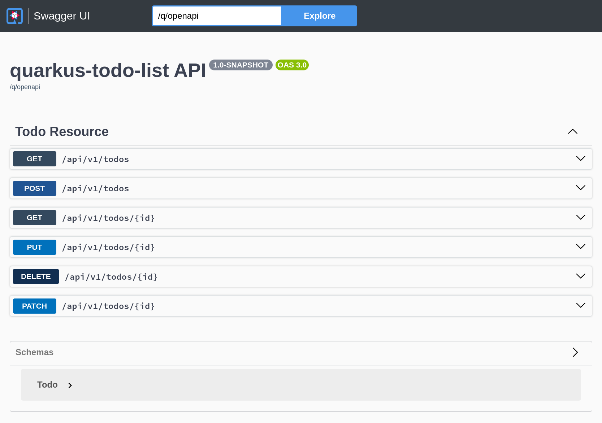

== Quarkus Todo List backend application

A Quarkus Todo list backend application that uses PostgreSQL as database server.

This is a simple backend application developed to learn how to:

- Develop a Rest API resource exposing a Todo resource.
- Develop testcases using test containers.
- How to use Quarkus with a PostgreSQL Database using Hibernate.
- Containerize a Quarkus microservice.
- How to deploy it on a container orchestrator as OpenShift.
- How to prepare it to be accessed from a frontend application developed with React.

This API is the backend of https://github.com/yborgess-pet-projects/react-todo-list.git[react-todo-list]

=== Basic requirements
- Requirements:
  - JDK 22+
  - Apache Maven 3.9.5+
  - A Container Engine, e.g. [podman](https://podman.io/)
  - A tool to interact with HTTP API exposed by this application, e.g. [httpie](https://httpie.io/)

== How to run it locally

1. Launch the Quarkus application with
+
[source]
----
$ mvn quarkus:dev
----
+
2. List all the todos:
+
[source]
----
$ http :8080/api/v1/todos
HTTP/1.1 200 OK
Content-Type: application/json;charset=UTF-8
content-length: 206

[
    {
        "completed": false,
        "id": 1,
        "title": "Buy tickets for the concert"
    },
    {
        "completed": true,
        "id": 2,
        "title": "Learn how to make a cheesecake"
    },
    {
        "completed": false,
        "id": 3,
        "title": "Replace the bicycle light batteries"
    }
]
----
+
These are the available endpoints for the Todo resource:
+

+
You can check the OpenAPI and Swagger resources to get more information about how to use the API. These resources are only activated for the default (dev) profile:
+
[source]
----
http://localhost:8080/q/openapi?format=json -> OpenApi documentation
http://localhost:8080/q/swagger-ui/ -> Swagger UI
----
+
3. To stop the application, use CTLR+C

== How to run it as a container

1. Build the project with `quarkus.container-image.build` property enabled. It will build and push the container to your local container registry under the name `quay.io/yborgess/todo-list-quarkus-boot-backend`:
+
[source]
----
$ mvn clean package -Dquarkus.container-image.build=true
----
+
2. Launch the application and database using the compose files shipped with this repository:
+
[source]
----
$ podman-compose \
-f ./deployment/container/postgresql.yml \
-f ./deployment/container/todo-list-app.yml \
up
----
+
This time the application will be launched by default with the "prod" profile. The Quarkus application will not populate the database with initial data. Execute the following command to add a new todo:
+
[source]
----
$ http POST :8080/api/v1/todos title="Read Quarkus documentation"
----
+
3. To stop the database and application containers:
+
[source]
----
$ podman-compose \
-f ./deployment/container/postgresql.yml \
-f ./deployment/container/todo-list-app.yml \
down
----

== How to run it on OpenShift

1. Apply the following resource:
+
[source]
----
$ oc apply -f ./deployment/openshift/deployment.yml
deployment.apps/todo-list-postgresql created
service/todo-list-database-svc created
persistentvolumeclaim/todo-list-database-pvc created
deployment.apps/todo-list-backend-deployment created
service/todo-list-backend-svc created
secret/todo-list-secret created
----
+
It launches the PostgreSQL database and two application replicas:
+
[source]
----
$ oc get pods
NAME                                            READY   STATUS    RESTARTS   AGE
todo-list-backend-deployment-7f496dc8bc-q98bk   1/1     Running   0          16s
todo-list-backend-deployment-7f496dc8bc-rsm6t   1/1     Running   0          16s
todo-list-postgresql-6dd7d8d74b-x5dch           1/1     Running   0          16s
----
+
The application is deployed using the prod profile, and it is not exposed to the outside. You can use the https://github.com/yborgess-pet-projects/react-todo-list.git[react-todo-list] frontend application to interact with it.

=== Cleanup the resources
To delete all the resources created by the backend, execute the following:

[source]
----
$ oc delete all -l tier=backend
----

The database uses a persistent storage that must be deleted explicitly:

[source]
----
$ oc delete pvc/todo-list-database-pvc
----
